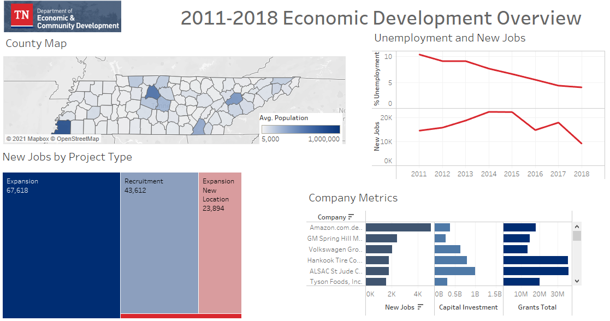

# TN Department of Economic and Community Development (ECD) Dashboard

## Description
The main product of this repo is the `ECD_Dashboard.twbx` This Tableau workbook contains an interactive dashboard based on 2011-2018 data from the ECD and a page relating to the Nashville Oracle expansion. 

The dashboard features: 

- a TN county map with a color gradient based on population size 
- a stacked line graph of unemployment rate and new jobs
- a tree map of project type distribution
- a table of company information including new jobs, capital investment, and total grants received
- filtering by county when clicking on the TN map
- filtering by year when clicking on either line graph
- filtering by project type when clicking on the tree map
- sorting the company table by each dimension in the headers

The Oracle page includes information about the expansion project as it relates to the ECD data, in addition to a quote from the ECD Commissioner about the expansion. This page, in conjunction with the main dashboard, is intended to provide context that demonstrates how significant Oracle's contribution will be relative to other Tennessee economic developments in the past decade. 

## Technologies
To complete this project, I used the following tools:
- SQL
- PostgreSQL (pgAdmin)
- Tableau

## Procedures
My steps to complete this project were as follows:
- importing the ECD database with pgAdmin
- cleaning the ECD data to eliminate duplicate rows [*used `DISTINCT *` to deduplicate*]
- querying the database to create 3 tables and saving these to CSV files: 
    - pop.csv 
    - ecd_w_landed_year.csv [*used `SUBSTRING(landed::text,0,5)` to extract year*]
    - avg_annual_unemployment.csv [*used `AVG(value) OVER(PARTITION BY county, year`) to calculate average annual unemployment from monthly data*]
- importing the files into Tableau and relating the tables by 'County' and 'Year'
- building graphs for main dashboard
- researching and incorporating Oracle expansion information for presentation
- sharing findings with Data Analytics Cohort who would be looking for tech jobs in the near future